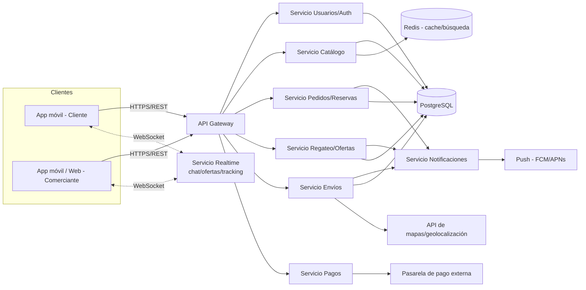
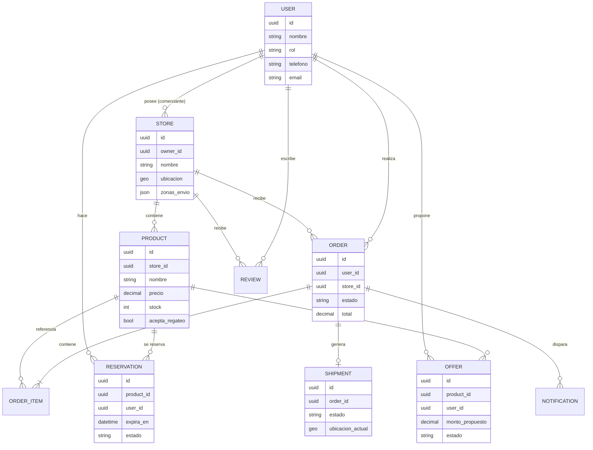

# Diseño técnico: App de marketplace para comerciantes y clientes

## 1. Resumen

Aplicación tipo marketplace donde comerciantes y dueños de supermercados publican
sus artículos, y los usuarios (clientes) navegan, compran, reservan o negocian
(regatean) precios. Incluye gestión de envíos/reservas y notificaciones en
tiempo real sobre el estado del pedido (p. ej. "el repartidor ya salió").

## 2. Roles de usuario

| Rol | Descripción |
|---|---|
| **Comerciante** | Sube y administra su catálogo (supermercado, tienda, vendedor individual). Gestiona stock, precios, pedidos, envíos y responde ofertas de regateo. |
| **Cliente** | Navega el catálogo, compra, reserva, hace ofertas de precio, sigue su pedido. |
| **Repartidor** (opcional, fase 2) | Recibe asignaciones de entrega y actualiza el estado del envío. |
| **Administrador** | Modera comerciantes/productos, gestiona comisiones, soporte y disputas. |

## 3. Funcionalidades principales

- **Catálogo de productos**: alta/edición/baja de artículos con fotos, precio,
  categoría, stock, variantes (talla/peso/unidad) y disponibilidad por tienda.
- **Búsqueda y descubrimiento**: por categoría, texto, cercanía (geolocalización),
  tienda o rango de precio.
- **Carrito y checkout**: multi-tienda, cálculo de envío, métodos de pago
  (efectivo contra entrega, tarjeta, billetera).
- **Reservas**: el cliente aparta un artículo por tiempo limitado sin pagarlo
  de inmediato (útil en supermercados con stock limitado).
- **Regateo (negociación de precio)**: el cliente envía una oferta sobre un
  producto; el comerciante acepta, rechaza o contraoferta. Historial de ofertas
  por producto/conversación.
- **Envíos**: el comerciante define zonas/costos de entrega o delega a un
  repartidor; tracking del pedido en tiempo real.
- **Notificaciones**: push al cliente y al comerciante en cada cambio de
  estado del pedido (confirmado → preparando → repartidor en camino/salió →
  entregado), y notificaciones de nuevas ofertas de regateo.
- **Calificaciones y reseñas**: de tienda y de producto, ambos sentidos
  (cliente califica tienda, comerciante puede calificar cliente).
- **Panel del comerciante**: reportes de ventas, control de inventario,
  gestión de pedidos y ofertas pendientes.

## 4. Arquitectura de alto nivel

- **API Gateway**: punto único de entrada, autenticación (JWT), rate limiting.
- **Servicios**: se puede iniciar como *monolito modular* (más simple de
  mantener al inicio) con estos módulos, y separar a microservicios si el
  volumen lo justifica.
- **Realtime**: WebSockets (o Firebase/Supabase Realtime) para regateo en vivo
  y tracking de envío.
- **Notificaciones**: cola de eventos (p. ej. Redis Streams o SQS) → servicio
  de notificaciones → FCM/APNs.
- **Cache/búsqueda**: Redis o Elasticsearch/Meilisearch para búsqueda de
  productos por texto/cercanía.

## 5. Modelo de datos (entidades principales)

## 6. Flujo de regateo (negociación)

1. Cliente ve un producto marcado `acepta_regateo = true`.
2. Cliente envía una `Offer` con el monto propuesto.
3. Comerciante recibe notificación en tiempo real y puede: **aceptar**,
   **rechazar** o **contraofertar** (nuevo monto).
4. Si se acepta, se genera un precio especial válido por tiempo limitado para
   que el cliente complete la compra.
5. Historial de ofertas queda asociado al producto y al usuario (para
   analítica y para evitar abuso/spam de ofertas).

## 7. Flujo de pedido, envío y notificaciones

Estados sugeridos: `creado → confirmado → en_preparacion → en_camino →
entregado` (o `cancelado` en cualquier punto antes de `entregado`).

Cada transición dispara una notificación push al cliente y, cuando aplica,
al comerciante/repartidor:

- `confirmado`: al cliente y comerciante.
- `en_preparacion`: al cliente.
- `en_camino` (repartidor salió): al cliente, con ETA si hay geolocalización.
- `entregado`: al cliente (para calificar) y al comerciante (para cerrar venta).

## 8. Pagos

- Métodos: efectivo contra entrega, tarjeta (pasarela externa: Stripe/PayPal/
  procesador local), billetera interna (saldo prepagado, opcional).
- Comisión de plataforma calculada por transacción o suscripción del
  comerciante (definir modelo de negocio).

## 9. Stack tecnológico sugerido

| Capa | Opción sugerida |
|---|---|
| App móvil (cliente y comerciante) | Flutter o React Native (una sola base para Android/iOS) |
| Panel web comerciante (opcional) | React/Next.js |
| Backend | Node.js (NestJS) o similar, API REST + WebSockets |
| Base de datos | PostgreSQL (transaccional) + Redis (cache/sesión) |
| Búsqueda | PostgreSQL full-text o Meilisearch/Elasticsearch |
| Notificaciones push | Firebase Cloud Messaging |
| Pagos | Stripe / pasarela local según país |
| Mapas/geolocalización | Google Maps Platform / Mapbox |
| Infraestructura | Contenedores (Docker) + un proveedor cloud (AWS/GCP) |

## 10. Fases sugeridas (MVP → completo)

1. **MVP**: registro comerciante/cliente, catálogo, carrito/checkout simple,
   estados de pedido básicos, notificaciones push.
2. **Fase 2**: reservas, regateo/ofertas en tiempo real, tracking de envío
   con geolocalización.
3. **Fase 3**: repartidores propios, panel de reportes avanzado, reseñas,
   billetera interna, promociones/cupones.

## 11. Consideraciones no funcionales

- **Seguridad**: autenticación JWT, verificación de comerciantes, cifrado en
  tránsito (TLS) y en reposo para datos sensibles (pagos, ubicación).
- **Escalabilidad**: separar servicios de catálogo/búsqueda y notificaciones
  primero, ya que son los de mayor carga en picos de tráfico.
- **Disponibilidad**: notificaciones y tracking en tiempo real son críticos
  para la experiencia — diseñar con reintentos y colas para no perder eventos.
